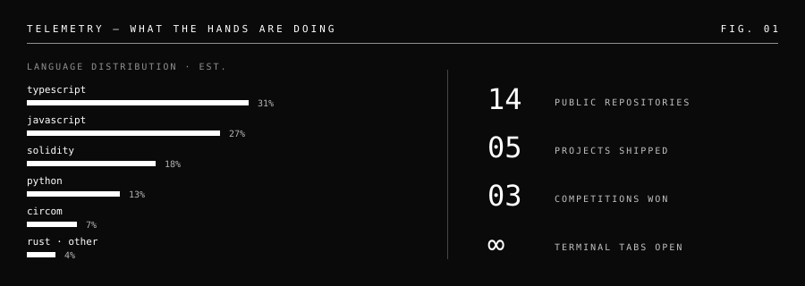

### hey im shrikar

i build things in web3 and ai.

i got here backwards  
started trading crypto got curious about what was actually happening under the charts and ended up writing the contracts instead.  
i'd rather ship something rough and fix it in public than read about it for six months.

 

**looking for** — roles where engineering meets product and ecosystem: gtm engineering, devrel, technical bd, founder associate. early-stage web3 and ai, seed to series b. remote or ready to move in n lock-in. → [shrikartadkasat@gmail.com](mailto:shrikartadkasat@gmail.com)

#### what i've worked on

- **founding team at xythum labs**, now [hisoka.io](https://hisoka.io) — wrote zk circuits for a confidential dark pool. zk-utxo model, frost threshold schnorr signatures, sphinx packet routing over a mixnet. the whole point was leaving mev bots nothing to read
- **[FlashGrid](https://github.com/ShrikarT/FlashGrid)** — 100 orders a block instead of 20, by isolating orders across price ticks so they stop colliding on storage. *monad blitz, special mention*
- **[BlockIntel](https://github.com/ShrikarT/blockintel)** — wallet risk scoring and multi-hop graph tracing for law enforcement, zero-shot classification over labeled address data. *smart india hackathon r2*
- **[ProofWork](https://github.com/ShrikarT/ProofWork)** — agents prove their reputation through midnight zk circuits without exposing job history, then get paid via cardano escrow.
- **[GhostLaunch](https://github.com/ShrikarT/GhostLaunch)** — private ido on encrypted erc. fund in the dark, distribute in the open, verify all of it.
- **right now** — rebuilding my hackathon projects into things that work end to end, going deeper on ai tech, and writing about it on [x](https://x.com/0xshrikar)

#### wins

- won **NamasteJupiverse hackathon**, hyd
- won **avalanche team1 hackathon**, hyd
- won **avalanche pitch day india**, representing xythum labs
- special mention in **monad blitz hackathon**, hyd
- selected for **Team1's mini grants program**, india cohort
- smart india hackathon 2025 round 2 qualifier

#### stack

`solidity` `python` `typescript` `rust` `sql`  
`circom` `hardhat` `ethers` `web3.js` `zk-proofs`  
`next.js` `react` `fastapi` `tailwind`  
`pytorch` `tensorflow` `opencv`  
`postgres` `mongodb` `docker` `linux` `dune`

#### telemetry

#### other things

traded crypto for 3+ years before i wrote a line of solidity — spot, perps, defi. order books and liquidity still make more intuitive sense to me than most rest apis do.

shipped an indie game called *demise* at 16 in unreal. might still be the most fun i've had building anything.  
im active with hyderabaddao. chess, gym, too many open terminal tabs.

i'm still filling gaps in my cs fundamentals — if you catch me reaching for something clever when the boring thing would work, tell me.

#### say hi

[x](https://x.com/0xshrikar) · [linkedin](https://www.linkedin.com/in/shrikartadkasat) · [shrikartadkasat@gmail.com](mailto:shrikartadkasat@gmail.com)
